Matrix Fun

```diff
- work in progress
```

## Task 1
Given the two following matrices: 

&nbsp;&nbsp;&nbsp;&nbsp;&nbsp;&nbsp;

Python with Numpy:

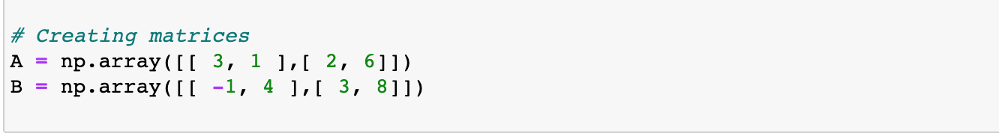

**(a)** Find 


&nbsp;&nbsp;&nbsp;&nbsp;&nbsp;&nbsp;


&nbsp;&nbsp;&nbsp;&nbsp;&nbsp;&nbsp;&nbsp;Python with Numpy:

&nbsp;&nbsp;&nbsp;&nbsp;&nbsp;&nbsp;&nbsp;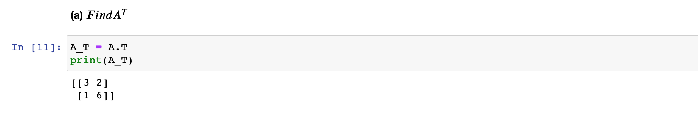


**(b)** Find 


&nbsp;&nbsp;&nbsp;&nbsp;&nbsp;&nbsp;

 &nbsp;&nbsp;&nbsp;&nbsp;&nbsp;&nbsp;&nbsp;Python with Numpy:
 
 &nbsp;&nbsp;&nbsp;&nbsp;&nbsp;&nbsp;&nbsp;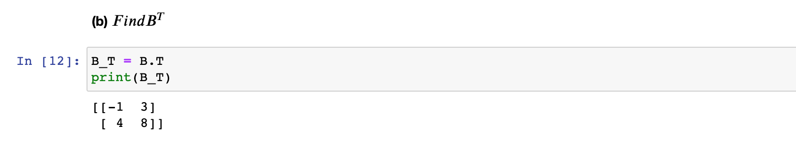
  
  
**(c)** Find AB (matrix multiplication). Compare with simple multiplication
(using * instead of @ in Python). Can you see what is the difference?

 - Using * on two matrices in python => elementwise multiplication:

&nbsp;&nbsp;&nbsp;&nbsp;&nbsp;&nbsp;&nbsp;&nbsp;&nbsp;&nbsp;&nbsp;&nbsp;

 - Using @ on two matrices in python => dot product:

&nbsp;&nbsp;&nbsp;&nbsp;&nbsp;&nbsp;&nbsp;&nbsp;&nbsp;&nbsp;&nbsp;&nbsp;

   
&nbsp;&nbsp;&nbsp;&nbsp;&nbsp;&nbsp;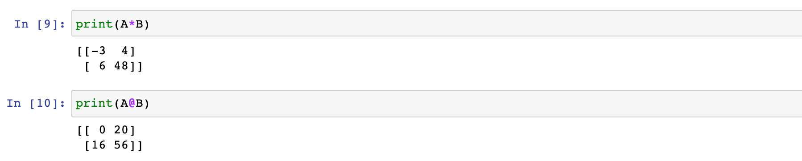
  
  
**(d)** Find 

&nbsp;&nbsp;&nbsp;&nbsp;&nbsp;&nbsp;&nbsp;&nbsp;&nbsp;&nbsp;&nbsp;&nbsp;

&nbsp;&nbsp;&nbsp;&nbsp;&nbsp;&nbsp;&nbsp;Python with Numpy:

&nbsp;&nbsp;&nbsp;&nbsp;&nbsp;&nbsp;&nbsp;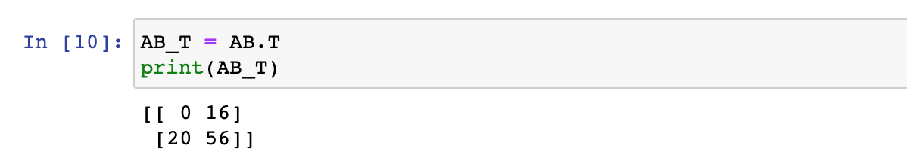


**(e)** Compare  and 

&nbsp;&nbsp;&nbsp;&nbsp;&nbsp;&nbsp;&nbsp;&nbsp;&nbsp;&nbsp;&nbsp;&nbsp;


&nbsp;&nbsp;&nbsp;&nbsp;&nbsp;&nbsp;&nbsp;&nbsp;&nbsp;&nbsp;&nbsp;&nbsp;


&nbsp;&nbsp;&nbsp;&nbsp;&nbsp;&nbsp;&nbsp;Python with Numpy:

&nbsp;&nbsp;&nbsp;&nbsp;&nbsp;&nbsp;&nbsp;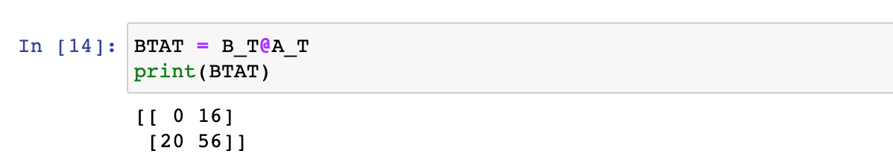


&nbsp;&nbsp;&nbsp;&nbsp;&nbsp;&nbsp;&nbsp;&nbsp;&nbsp;&nbsp;&nbsp;&nbsp;&nbsp;&nbsp;&nbsp;&nbsp;&nbsp;&nbsp;&nbsp;


**(f)** Find 

&nbsp;&nbsp;&nbsp;&nbsp;&nbsp;&nbsp;&nbsp;


&nbsp;&nbsp;&nbsp;&nbsp;&nbsp;&nbsp;&nbsp;Python with Numpy:

&nbsp;&nbsp;&nbsp;&nbsp;&nbsp;&nbsp;&nbsp;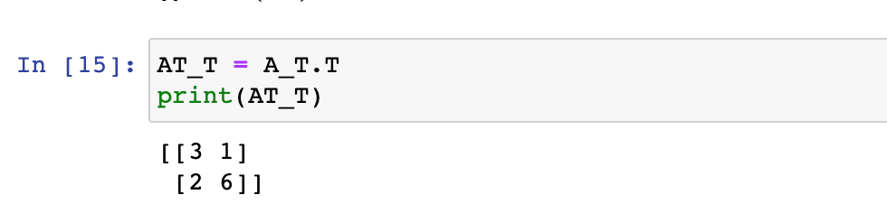


**(g)** Find 


&nbsp;&nbsp;&nbsp;&nbsp;&nbsp;&nbsp; &nbsp;&nbsp;&nbsp;&nbsp;&nbsp;&nbsp;&nbsp; 


&nbsp;&nbsp;&nbsp;&nbsp;&nbsp;&nbsp;


&nbsp;&nbsp;&nbsp;&nbsp;&nbsp;&nbsp;&nbsp;Python with Numpy:

&nbsp;&nbsp;&nbsp;&nbsp;&nbsp;&nbsp;&nbsp;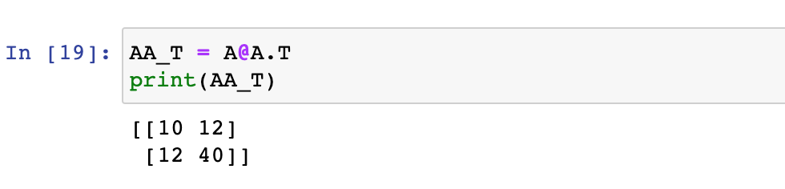


# Task 2

Given 


**(a)** Find 


&nbsp;&nbsp;&nbsp;&nbsp;&nbsp;&nbsp;&nbsp;


&nbsp;&nbsp;&nbsp;&nbsp;&nbsp;&nbsp;&nbsp;Python with Numpy:

&nbsp;&nbsp;&nbsp;&nbsp;&nbsp;&nbsp;&nbsp;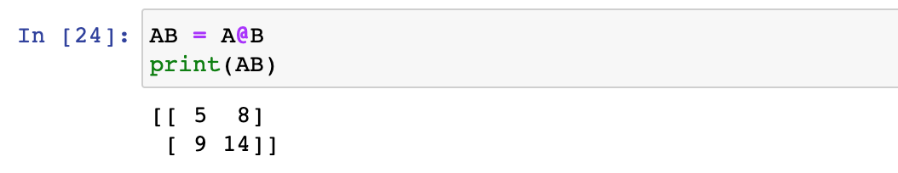


**(b)** Find 

&nbsp;&nbsp;&nbsp;&nbsp;&nbsp;


&nbsp;&nbsp;&nbsp;&nbsp;&nbsp;&nbsp;&nbsp;Python with Numpy:

&nbsp;&nbsp;&nbsp;&nbsp;&nbsp;&nbsp;&nbsp;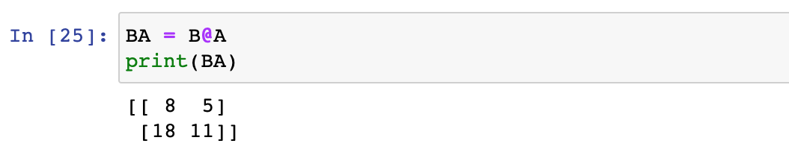


# Task 3

The inverse of a matrix   is found by 


As seen in listing 1, the inverse of a matrix can be found easily with numpy
(after having imported numpy.linalg.inv) by: inv(A).
Using the same matrices from Task 2:

**(a)** Find 


&nbsp;&nbsp;&nbsp;&nbsp;&nbsp;&nbsp;&nbsp;Python with Numpy:

&nbsp;&nbsp;&nbsp;&nbsp;&nbsp;&nbsp;&nbsp;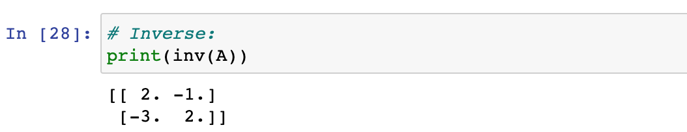


**(b)** Find 


&nbsp;&nbsp;&nbsp;&nbsp;&nbsp;&nbsp;&nbsp;Python with Numpy:

&nbsp;&nbsp;&nbsp;&nbsp;&nbsp;&nbsp;&nbsp;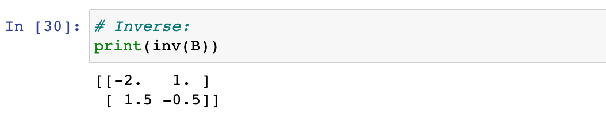


**(b)** Find 

