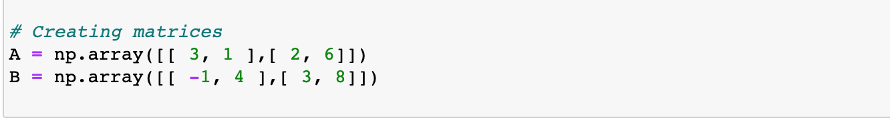
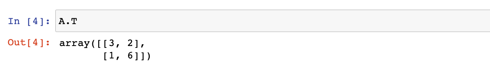
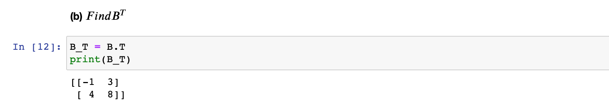
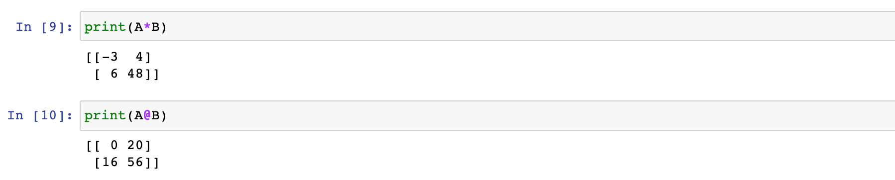

Matrix Fun

```diff
- work in progress
```

## Task 1
Given the two following matrices: 

&nbsp;&nbsp;&nbsp;&nbsp;&nbsp;&nbsp;

 &nbsp;&nbsp;&nbsp;&nbsp;&nbsp;&nbsp;  

**(a)** Find 


&nbsp;&nbsp;&nbsp;&nbsp;&nbsp;&nbsp;


  &nbsp;&nbsp;&nbsp;&nbsp;&nbsp;&nbsp;


**(b)** Find 


&nbsp;&nbsp;&nbsp;&nbsp;&nbsp;&nbsp;

 &nbsp;&nbsp;&nbsp;&nbsp;&nbsp;&nbsp; 
  
  
**(c)** Find AB (matrix multiplication). Compare with simple multiplication
(using * instead of @ in Python). Can you see what is the difference?

 - Using * on two matrices in python => elementwise multiplication:

&nbsp;&nbsp;&nbsp;&nbsp;&nbsp;&nbsp;&nbsp;&nbsp;&nbsp;&nbsp;&nbsp;&nbsp;

 - Using @ on two matrices in python => dot product:

&nbsp;&nbsp;&nbsp;&nbsp;&nbsp;&nbsp;&nbsp;&nbsp;&nbsp;&nbsp;&nbsp;&nbsp;

   
&nbsp;&nbsp;&nbsp;&nbsp;&nbsp;&nbsp;
  
  
**(d)** Find 
